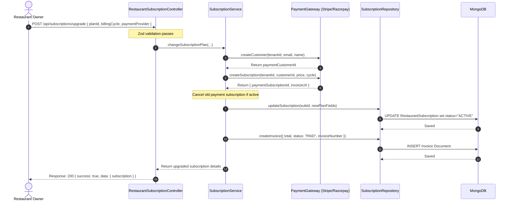

# SaaS Subscription & Billing System Documentation

This module implements a complete, highly-scalable multi-tenant SaaS Subscription & Billing System for FoodMesh.

---

## 1. Complete Folder Structure

All subscription module elements are organized in a structured, decoupled layout:

```
server/src/subscription/
├── enums/
│   └── subscription.enum.ts          # SubscriptionStatus, BillingCycle, PaymentProvider
├── interfaces/
│   ├── subscription.interface.ts     # TypeScript typings for Plans, Subscriptions, and Invoices
│   └── payment-gateway.interface.ts  # Abstraction layer for pluggable processors
├── models/
│   ├── subscription-plan.model.ts    # Mongoose schema for feature sets & hard resource limits
│   ├── restaurant-subscription.model.ts # Mongoose schema for active billing states
│   ├── invoice.model.ts              # Mongoose schema for financial receipt logs
│   └── subscription-usage.model.ts   # Mongoose schema for tracking monthly consumption
├── validators/
│   └── subscription.validator.ts     # Zod request validators
├── repositories/
│   └── subscription.repository.ts    # Clean database data access layer
├── services/
│   └── subscription.service.ts       # Core SaaS lifecycle state machine & payment orchestration
├── gateways/
│   ├── stripe.gateway.ts             # Stripe subscription mock integration
│   ├── razorpay.gateway.ts           # Razorpay link mock integration
│   └── manual.gateway.ts             # Manual activation panel hooks
├── controllers/
│   ├── admin-subscription.controller.ts # Super Admin dashboard API handlers
│   └── restaurant-subscription.controller.ts # Tenant self-service dashboard API handlers
├── middlewares/
│   └── subscription.middleware.ts    # requireActiveSubscription, requireFeature, checkUsage
├── jobs/
│   └── subscription.job.ts           # Scheduled trial checking & usage resets
└── events/
    └── subscription.event.ts         # Warning alerts, success logs, and web push publisher
```

---

## 2. Sequence Diagram: Plan Upgrade & Settle Lifecycle

Below is the workflow sequence showing how a restaurant tenant initiates a plan upgrade:



---

## 3. Database Indexes

To support high performance for thousands of concurrent tenants, the following indexes are defined:

### RestaurantSubscription Indexes
- `{ tenantId: 1 }` - Fast isolation of a tenant's billing profile.
- `{ tenantId: 1, status: 1 }` - Optimizes middleware checking of active/trial tenants.
- `{ endDate: 1, status: 1 }` - Speed up daily expiration checks in background jobs.

### Invoice Indexes
- `{ tenantId: 1 }` - Optimizes owner invoice history lookup page.
- `{ invoiceNumber: 1 }` - Unique index for fast transactional searches.

### SubscriptionUsage Indexes
- `{ tenantId: 1, month: 1, year: 1 }` - Unique index to log and look up monthly counts.

---

## 4. API Endpoints

### Super Admin Endpoints (SaaS Platform Management)

#### 1. List Plans
- **Route**: `GET /api/subscriptions/plans`
- **Auth**: Super Admin
- **Response**:
```json
{
  "success": true,
  "message": "Plans retrieved successfully",
  "data": {
    "plans": [
      {
        "_id": "6a3c17666bb70afe757e1111",
        "name": "Starter Plan",
        "slug": "starter",
        "monthlyPrice": 999,
        "yearlyPrice": 9990,
        "features": { "inventory": true, "crm": true, "qrOrdering": true },
        "limits": { "outlets": 2, "employees": 15, "monthlyOrders": 1000000 }
      }
    ]
  }
}
```

#### 2. Create Plan
- **Route**: `POST /api/subscriptions/plans`
- **Auth**: Super Admin
- **Payload**:
```json
{
  "name": "Starter Plan",
  "slug": "starter",
  "monthlyPrice": 999,
  "yearlyPrice": 9990,
  "features": {
    "inventory": true,
    "crm": true,
    "analytics": true,
    "kitchenDisplay": true,
    "waiterApp": true,
    "qrOrdering": true
  },
  "limits": {
    "outlets": 2,
    "employees": 15,
    "monthlyOrders": 10000,
    "menuItems": 500,
    "storageGB": 5
  }
}
```

#### 3. Update Plan
- **Route**: `PUT /api/subscriptions/plans/:id`
- **Auth**: Super Admin

#### 4. Delete Plan (Soft Delete)
- **Route**: `DELETE /api/subscriptions/plans/:id`
- **Auth**: Super Admin

#### 5. SaaS Subscription list
- **Route**: `GET /api/subscriptions/admin/list`
- **Auth**: Super Admin

#### 6. SaaS Invoices list
- **Route**: `GET /api/subscriptions/admin/invoices`
- **Auth**: Super Admin

#### 7. SaaS Financial & Conversion Analytics
- **Route**: `GET /api/subscriptions/admin/analytics`
- **Auth**: Super Admin
- **Calculates**: MRR, ARR, ARPU, Trial counts, and popularity metrics.

---

### Restaurant Owner Endpoints (Self-Service Dashboard)

#### 1. Retrieve Current Active Subscription
- **Route**: `GET /api/subscriptions/my-subscription`
- **Auth**: Restaurant Owner

#### 2. Retrieve Resource Usage Indicators
- **Route**: `GET /api/subscriptions/usage`
- **Auth**: Restaurant Owner
- **Response**:
```json
{
  "success": true,
  "message": "Monthly resource usage metrics retrieved",
  "data": {
    "usage": {
      "ordersUsed": 85,
      "employeesUsed": 4,
      "outletsUsed": 1
    }
  }
}
```

#### 3. Upgrade Plan
- **Route**: `POST /api/subscriptions/upgrade`
- **Auth**: Restaurant Owner
- **Payload**:
```json
{
  "planId": "6a3c17666bb70afe757e1111",
  "billingCycle": "MONTHLY",
  "paymentProvider": "stripe"
}
```

#### 4. Cancel Auto-Renewal
- **Route**: `POST /api/subscriptions/cancel`
- **Auth**: Restaurant Owner
- **Effect**: Retains active access until end of current billing cycle but disables future charges.
